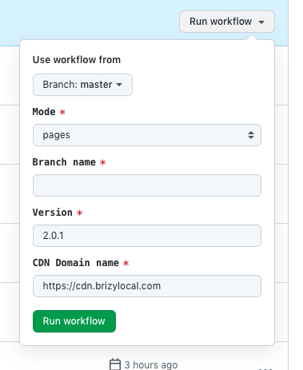

# Local Development

### Make sure do you have
- `node` >= 16
- `npm` >= 7

## Installation

Copy / Paste .env.sample

```shell
cp .env.example .env
```

Install | Build

```shell
npm install

# Start dev server and build --watch
npm start

# Or only dev server
npm run server

# Or only build
npm run build

# Checks
npm run tsc
```

## Deploy
Deployment is configured via GitHub actions



Keys
- Mode: builder mode story, pages, popup
- Branch name: create deploy for specific branch
- Version: indicate next builder version, version need contain only number `2.0.1`
- CDN Domain name: currently we use bunny cdn for S3 bucket
